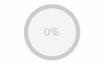

# 

Vue CSS Percentage Circle
==========================

## Getting Started

```
npm install --save vue-css-percentage-circle
```

### Usage

```
<PercentageCircle :percent="50" />
```

#### Theming

```
<PercentageCircle :percent="50" active-color="blue" complete-color="green"/>
<PercentageCircle :percent="50" active-color="green" complete-color="orange"/>
<PercentageCircle :percent="50" active-color="orange" complete-color="blue"/>
```

#### Animated

```
<PercentageCircle :percent="50" :animate="true"/>
```

#### Dark Mode

```
<PercentageCircle :percent="50" :dark-mode="true" />
```

## API

### percentage-circle 

#### props 

- `percent` ***Number*** (*optional*) 

  Percentage of progress (0-100) 

- `size` ***String*** (*optional*) `default: 'small'` 

  Size of percentage circle [micro, small, big] 

- `active-color` ***String*** (*optional*) `default: 'blue'` 

  Color when active. [blue, green, orange] 

- `complete-color` ***String*** (*optional*) `default: ''` 

  Color when complete. [blue, green, orange] 

- `animate` ***Boolean*** (*optional*) `default: false` 

  Animate percentage changes. 

- `refresh-rate` ***Number*** (*optional*) `default: 5` 

  Only applicable when animated is set to true. Speed in which animation changes happen 

- `dark-mode` ***Boolean*** (*optional*) `default: false` 

  Toggle between normal and dark themes 

#### events 

- `click` 

  Click event. 

## Testing

Storybook used for testing. To run storybook, run:
```
npm run dev
```

or

```
npm run storybook
```